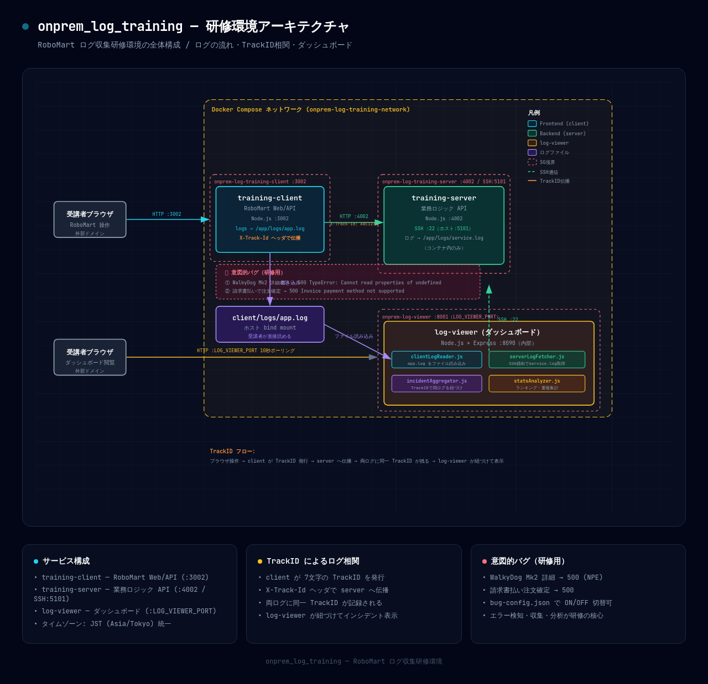

# log-viewer — ログ可視化ダッシュボード

`onprem_log_training` 研修環境のログをリアルタイムで可視化する Node.js + Express 製ダッシュボードです。

このダッシュボードは、RoboMart（架空のロボット販売ECサイト）の研修用ログ出力環境を実際に使いながら
**ログ収集・分析ツールをAIエージェントと共に作る学習**のために構築しました。
受講者が自作するログ収集ツールの参考実装としても活用できます。

---

## 概要

- `client/logs/app.log`（clientログ、ローカルファイル）と  
  `server` の `/app/logs/service.log`（serverログ、SSH経由）を読み込み、  
  **TrackIDで紐づけたインシデント一覧**をブラウザで表示します。
- 10秒ごとに自動ポーリングしてリアルタイムに反映されます。
- SSH未接続時も `serverReachable: false` として動作継続（クラッシュしない設計）。

---

## 研修環境の全体構成



> 詳細なアーキテクチャ図ソース: [docs/architecture.html](docs/architecture.html)（ブラウザで開くとインタラクティブに確認できます）

---

## ディレクトリ構成

```
log-viewer/
├── Dockerfile
├── package.json          # 依存: express, ssh2
├── server.js             # Express エントリポイント
├── lib/
│   ├── clientLogReader.js    # app.log 読み込み・パース
│   ├── serverLogFetcher.js   # SSH経由 service.log 取得（ssh2）
│   ├── incidentAggregator.js # TrackIDで両ログを紐づけ
│   └── statsAnalyzer.js      # ランキング・重複・開始/終了時刻集計
└── public/
    ├── index.html        # ダッシュボード UI
    ├── style.css         # ダークテーマ
    └── app.js            # ポーリング・描画・フィルタ
```

---

## 起動方法

### Docker（推奨、docker-compose統合）

`onprem_log_training/docker/docker-compose.yml` に `log-viewer` サービスが定義されています。
親ディレクトリから一括起動します。

```bash
cd ../docker
docker-compose up -d --build
```

ブラウザで `http://<外部ドメイン>:<LOG_VIEWER_PORT>/` を開きます。  
`LOG_VIEWER_PORT` は `.env` の `LOG_VIEWER_PORT` で指定してください（環境のSG/ファイアウォールで開放済みのポートに合わせること）。

### ローカル起動（Dockerなし）

外部ネットワーク制限などでコンテナビルドできない場合、ホストで直接起動できます。

```bash
cd log-viewer
node server.js
```

> **前提:** `client/logs/app.log` がホストに存在すること（clientを先に起動してください）。

---

## 環境変数

| 変数 | デフォルト | 説明 |
|---|---|---|
| `PORT` | `8090` | サーバー公開ポート |
| `CLIENT_LOG_PATH` | `../../client/logs/app.log` | clientログのパス |
| `SSH_HOST` | `localhost` | SSH接続先ホスト（Docker内では `training-server`） |
| `SSH_PORT` | `5101` | SSH接続先ポート（Docker内では `22`） |
| `SSH_KEY_PATH` | `../../../docker/sample-data/training_key` | SSH秘密鍵パス |

---

## API エンドポイント

| エンドポイント | メソッド | 説明 |
|---|---|---|
| `/health` | GET | `{"status":"ok","port":8090}` |
| `/api/summary` | GET | ダッシュボード用サマリー（後述） |
| `/api/incidents` | GET | TrackID紐づきインシデント一覧 |
| `/api/incidents/:trackId` | GET | 特定TrackIDの詳細 |
| `/api/logs/client` | GET | clientログ rawモード（`?limit=N`） |

### `/api/summary` レスポンス例

```json
{
  "totalRequests": 142,
  "errorCount": 18,
  "errorRate": "12.7%",
  "startTime": "2026-07-25T09:00:00.000+09:00",
  "endTime":   "2026-07-25T09:30:45.123+09:00",
  "durationMinutes": 35.75,
  "serverReachable": true,
  "levelCounts": { "ERROR": 18, "INFO": 120, "WARN": 4, "DEBUG": 0, "UNKNOWN": 0 },
  "pathErrorRanking":   [{ "path": "/api/robots/RBT-DOG-02", "count": 8 }],
  "messageRanking":     [{ "message": "TypeError: Cannot read properties of ...", "count": 10 }],
  "duplicates":         [{ "key": "ERROR|/api/robots/RBT-DOG-02", "count": 8, "trackIds": ["ABC1234"] }]
}
```

---

## ダッシュボード画面構成

```
┌─────────────────────────────────────────────────────────┐
│  🪵 Log Viewer Dashboard          [ERRORのみ] [🔄更新]  │
├──────┬──────┬──────┬──────┬──────┬──────┬──────────────┤
│総Req │ERROR │Error%│開始  │終了  │観測分│Server SSH    │
├──────────────────┬──────────────────┬───────────────────┤
│エラーパス Top10  │エラーメッセージ  │重複ログ集計       │
│                  │Top10             │(level|path別)     │
├──────────────────┴──────────────────┴───────────────────┤
│📊 インシデント一覧                                      │
│ TrackID │ レベル │ タイムスタンプ │ パス │ Client│Server│
│ ← 行クリックで詳細パネルを展開 →                       │
└─────────────────────────────────────────────────────────┘
```

### 画面の機能

| 機能 | 説明 |
|---|---|
| サマリーカード | 総リクエスト数・ERROR件数・エラー率・観測時間・SSH接続状態を表示 |
| エラーパスランキング | エラーが多く発生しているAPIパス Top10 |
| エラーメッセージランキング | 頻出エラーメッセージ Top10 |
| 重複ログ集計 | 同一パターン（level\|path）で繰り返しているインシデントを集計 |
| インシデント一覧 | TrackIDごとに Client/Server ログを紐づけて表示 |
| 詳細パネル | 行クリックで対象TrackIDの全ログ行を展開表示 |
| ERRORのみフィルタ | チェックボックスでERROR以外のインシデントを非表示 |
| 自動ポーリング | 10秒ごとに `/api/summary` と `/api/incidents` を自動取得 |

---

## ログフォーマット

`onprem_log_training` のログはすべて以下の形式で出力されます（タイムスタンプはJST）。

```
<ISO8601タイムスタンプ+09:00> <LEVEL> TrackID:<7文字> [<パス>] method=<メソッド> key=value ...
```

例:

```
2026-08-02T07:37:07.869+09:00 ERROR TrackID:ABC1234 [/api/robots/RBT-DOG-02] method=GET status=500 err=TypeError: Cannot read properties of undefined (reading 'map')
```

- **TrackID正規表現:** `TrackID:([A-Z0-9]{7})`
- LEVEL: `INFO` / `WARN` / `ERROR` / `DEBUG`

---

## モジュール設計

```
clientLogReader.js
  └─ readClientLog()   … app.log を末尾N行読み込む
  └─ parseLine()       … 1行をパースして { timestamp, level, trackId, path, details } を返す

serverLogFetcher.js
  └─ fetchServerLog()  … SSH経由で service.log の末尾N行を取得
  └─ grepServerLog()   … SSH経由で特定TrackIDの行を検索
  └─ checkReachable()  … SSH接続可否を確認

incidentAggregator.js
  └─ aggregateIncidents() … 両ログをTrackIDで紐づけてインシデント配列を生成

statsAnalyzer.js
  └─ buildSummary()    … インシデント配列からダッシュボード用サマリーを生成
```

依存関係は一方向（`statsAnalyzer` → `clientLogReader`、循環参照なし）。

---

## 注意事項

- SSH未接続時（serverコンテナ未起動など）は `serverReachable: false` でインシデント一覧の
  `serverLogs` が空配列になりますが、ダッシュボード自体はクラッシュしません。
- ログが空の場合（コンテナ起動直後など）、全集計値は `0` / `null` で正常レスポンスします。
